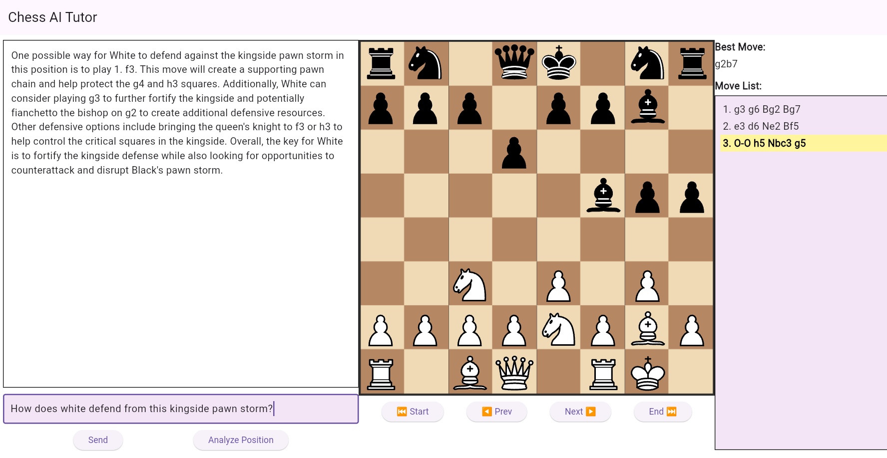
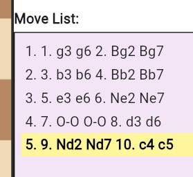
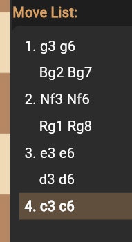
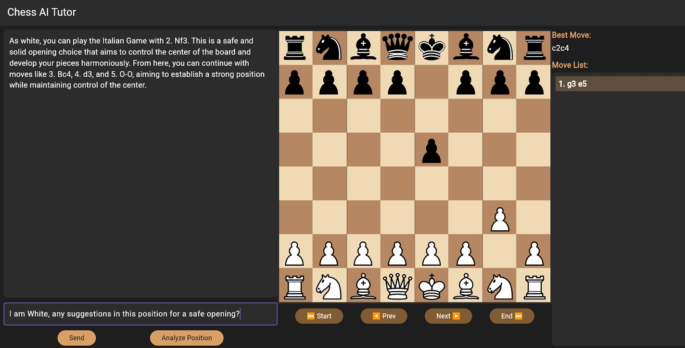
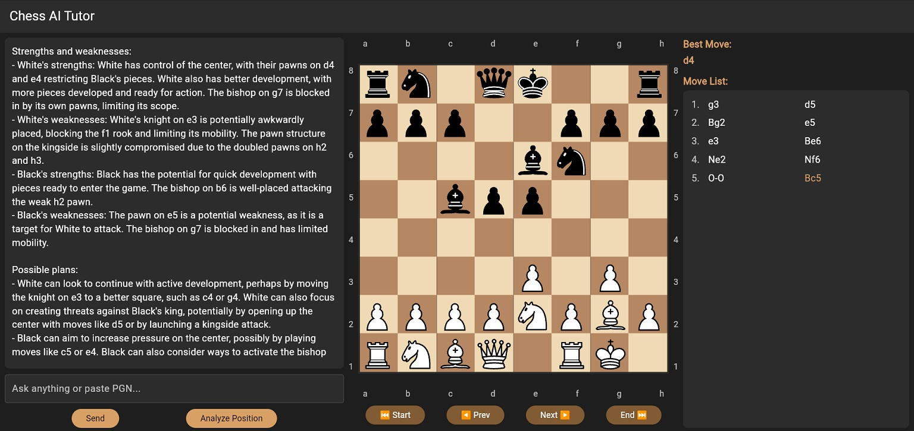

# 📘 Chess AI Tutor — React + FastAPI AI Chess Analysis Tool


A hybrid AI chess analysis system combining **React + Vite + Tailwind**, **FastAPI**, **Stockfish**, and an **LLM-based coach** into a clean, modern, snapshot-based tutor interface.

This MVP demonstrates full-stack engineering, deterministic engine analysis, and natural-language move explanations presented through a custom-built React interface.

**Live FRONTEND ONLY Demo:** https://chess-ai-tutor-react.web.app

If you want full functionality, run locally.
 

---

## 🧠 Project Summary

Chess AI Tutor is a two-part system:

• A **React** front end for visualizing positions, navigating moves, and interacting with the AI coach  
• A **FastAPI** backend orchestrating **Stockfish** and an **LLM** to produce structured, natural language coaching

Originally prototyped in Flutter, the project was fully **rewritten in React** to improve deployment control, UI behavior, maintainability, and ecosystem support. The rewrite included UI cleanup, improved move list logic, complete layout restructuring, and a safer, more predictable coaching endpoint.

This is an MVP built to showcase **architecture, integration, and engineering clarity**, not to replace full commercial chess engines.

---

## 🎯 Features

### Engine + AI Integration
• Snapshot-based position analysis  
• Best-move evaluation  
• LLM-generated explanations  
• Structured “Coach” endpoint  

### UI / Interaction
• Clean two-panel React layout  
• Scrollable move list  
• Gold-accented navigation controls  
• Chat-style analysis  
• Tailwind dark theme  

### Architecture Benefits
• Predictable Vite build  
• Clean separation of logic  
• Local Stockfish evaluation  

---

## 🏗 System Architecture

```
React (Vite + Tailwind)
        ↓
    FastAPI Backend
        ↓
   ┌───────────────┐
   │  Stockfish     │
   └───────────────┘
        ↓
   ┌───────────────┐
   │   LLM Coach    │
   └───────────────┘
        ↓
    React UI Panels
```

---

## 🔧 Technical Stack

**Languages:** Python, JavaScript (React)
**Frontend:** React, Vite, Tailwind CSS, react-chessboard  
**Backend:** FastAPI, Uvicorn, Pydantic, python-chess, Stockfish (local chess engine)  
**AI:** OpenAI API GPT Models  
**Tools:** Git, GitHub, VS Code, Node/npm, Python

---

## 📂 Project Structure

```
chess-ai-app/
│
├── chess-frontend/       # React (Vite + Tailwind)
├── chess-backend/        # FastAPI backend (Stockfish + AI)
├── screenshots/          # UI development journey
│
└── README.md
```

---

## 🚀 Running the Full System Locally

Developed using Python 3.10.x


### 1. Clone

```
git clone https://github.com/ChrisDevAI/chess-ai-app.git
cd chess-ai-app
```

---

### 2. Backend Setup

```
cd chess-backend
python -m venv venv
venv\Scripts\activate
pip install -r requirements.txt
```

Rename `.env.example` to `.env`, and add your OpenAPI API Key:

```
OPENAI_API_KEY=your_key_here
```

Run backend:

```
uvicorn main:app --reload --port 8000
```

---

### 3. Frontend Setup

```
cd ../chess-frontend
npm install
npm run dev
```

---

# 🛠 Development Journey (Full Evolution)

## Early Prototype written in Flutter


---

## Early Move List Issues


---

## Mid-Development Bugs



---

## Mid-Stage UI Improvements


---

## Final UI in Flutter prototype



## Final UI in React (current, after rewrite)


---

# 🔁 Flutter → React Rewrite

Rewrite advantages:

• Faster Vite builds  
• Tailwind styling  
• DOM layout reliability  
• Eliminated scroll bugs  
• Clearer separation of backend/frontend  
• Improved coach endpoint  

---

# 📈 Future Roadmap

• PGN import/export  
• Evaluation bar  
• Engine depth controls  
• Move-by-move explanations  
• Counterfactual reasoning  
• Cloud backend deployment  
• Docker backend  

---

# 📄 License

MIT License

---

# 👤 Author

**Christopher Mena**  
AI/ML Engineer  
GitHub: https://github.com/ChrisDevAI  
Website: https://ChrisAI.dev  
LinkedIn: https://linkedin.com/in/ChrisDevAI

---


